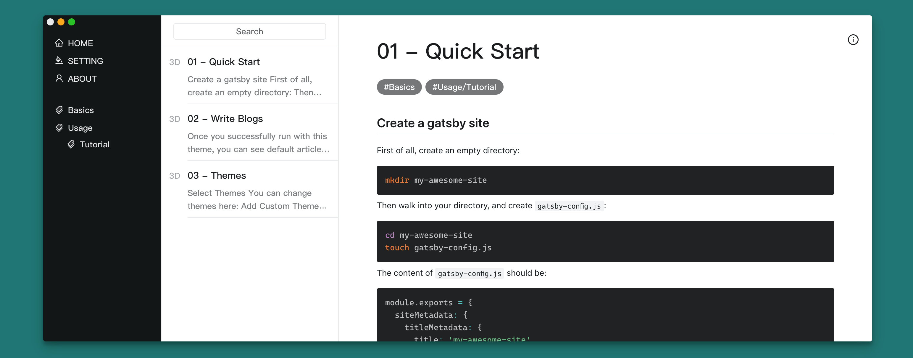

# Gatsby-theme-bear workspace

This repo contains both the source code for `gatsby-theme-bear` and an example site.


[Online demo](https://zmen.github.io/gatsby-theme-bear/)

## Quick Start

```shell
yarn install // install packages workspaces
npm run develop // run example locally
npm run build // build example site
```

For more information, please refer to [README](./gatsby-theme-bear/README.md)

