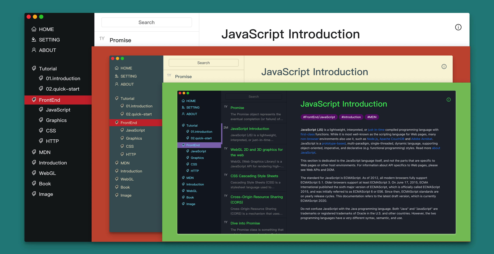

<p align="center">
  <a href="https://www.gatsbyjs.org">
    
  </a>
</p>
<h1 align="center">
  Gatsby Bear Starter
</h1>

This is a static blog generator and a gatsby starter repo.

Inspired by the [Bear App](https://bear.app/).



## Features

- **Tag Based** article system
- Easy to add and switch **Themes**, dark mode or light mode
- **mobile** friendly
- Styled with **styled-component**
- markdown code highlight with **remark** and **prismjs**
- support **i18n** with `gatsby-plugin-react-i18next`

## Quick Start

### Create a Gatsby site

Use the Gatsby CLI to create a new site, specifying the blog starter.

```shell
gatsby new my-blog-starter https://github.com/zmen/gatsby-starter-bear
```
### Start developing

Navigate into your new site's directory and start it up.

```shell
cd my-blog-starter
npm install
npm start
```

### Build for production

```shell
npm run build
npm run serve // to test those dist files
```
