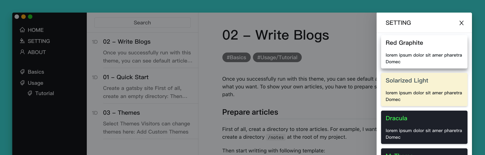

## Select Themes

You can change themes here:



## Add Custom Themes

To add more custom themes, you can create a file at `/your-project-root/src/gatsby-theme-bear/source/theme.custom.ts`.

Here is an example:

```typescript
const customThemes = [
  {
    /* Theme Name */
    name: 'MyTheme',
    /* Tell plugin if your theme is 'dark' or 'light' */
    /* If it's dark, it will use a dark theme for markdown body */
    darkMode: 'true',
    source: {
      'body-bg-color': '#26C166',
      'menu-bg-color': '#1a1b24',
      'menu-font-color': '#7ce4fc',
      'primary-color': '#8f74b8',
      'primary-font-color': '#45eb63',
      'search-highlight-color': '#7ce4fc',
      'tag-bg-color': '#6c1b76',
      'tag-font-color': '#fff',
      'primary-border-color': '#1a1b24',
      'container-bg-color': '#282a36',
      'container-shadow': '0 3px 6px rgba(255,255,255,0.16), 0 3px 6px rgba(255,255,255,0.23)',
      'text-color': '#eee',
    }
  }
];
export default customThemes;
```
