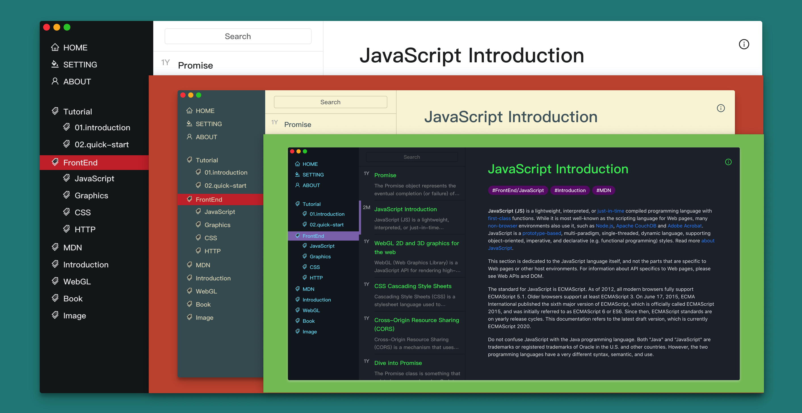

<p align="center">
  <a href="https://www.gatsbyjs.org">
    
  </a>
</p>
<h1 align="center">
  Gatsby Theme Bear
</h1>


This is a gatsby theme to generate a out-of-box blog site, which Inspired by the [Bear App](https://bear.app/).



## Features

- **Tag Based** article system
- Easy to add and switch **Themes**, dark mode or light mode
- **mobile** friendly
- Styled with **styled-component**
- markdown code highlight with **remark** and **prismjs**
- support **i18n** with `gatsby-plugin-react-i18next`

## Quick Start

## Create a Gatsby Site

First of all, create a directory with `react`, `react-dom` and `gatsby` as devDependencies.

```json
{
  "name": "project name",
  "scripts": {
    "develop": "gatsby develop",
    "build": "gatsby build",
    "serve": "gatsby serve"
  }
}
```

Then install dependencies:

```shell
npm i react react-dom gatsby gatsby-theme-bear
```

Finally, create and config `gatsby-config.js`:

```javascript
const path = require('path');

module.exports = {
  siteMetadata: {
    title: 'example',
    description: 'example description',
    author: 'name',
    githubAuthToken: 'your token',
  },
  plugins: [{
    resolve: 'gatsby-theme-bear',
    options: {
      contentPath: path.join(__dirname, './notes/')
    } ,
  }]
}
```

Make sure that you have markdown files in your content path.
Run `npm run develop` to develop locally.
